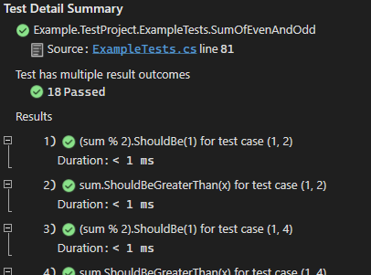

# FlUnit

[](https://www.nuget.org/packages/FlUnit/) [](https://www.nuget.org/packages/FlUnit/)

A test framework in which tests are defined using a fluent builder. Includes a very basic VSTest adapter which records each assertion in a separate result of the test. 

## Usage Guidance

### Getting Started

Create a (.NET 5) class library and add some package references:
- [`Microsoft.NET.Test.Sdk`](https://www.nuget.org/packages/Microsoft.NET.Test.Sdk/) - to identify this as a test project
- [`FlUnit`](https://www.nuget.org/packages/FlUnit/) - which contains the important stuff - the builder and test classes
- [`FlUnit.Adapters.VSTest`](https://www.nuget.org/packages/FlUnit.Adapters.VSTest/) - the VSTest adapter package, so that the VSTest platform knows how to find and run FlUnit tests.
- You'll also need to include an assertion library of your choice - the example code below uses [`Shouldly`](https://www.nuget.org/packages/Shouldly/), for example.
- [`coverlet.collector`](https://www.nuget.org/packages/coverlet.collector/) does work with FlUnit tests - so feel free to add that, too.

As shown below, tests are defined as public static gettable properties of public static classes, with the help of a fluent builder to construct them. More examples can be found in the [example test project](./src/Example.TestProject/ExampleTests.cs).

```csharp
using FlUnit;
// 
// NB: The examples here use an overload of 'Then' clauses with a single LINQ expression-valued
// parameter, which is used to automatically name the test result. Shouldly v4 adds optional
// parameters to many of its assertion methods - which LINQ expressions can't represent - meaning
// that the examples here only work as-is with Shouldly v3-. If you're using v4+, or a different
// assertion library that LINQ expressions also can't represent - or indeed if you'd simply prefer
// it - you can use the overload of the 'Then' clauses that requires the test result label to be
// provided explicitly as the second parameter.
using Shouldly;

public static class MyTests
{
  // First, a heavily annotated example.
  // Start by calling a method on the "TestThat" static class - each of which return a builder to continue with.
  public static Test WidgetCanProcessAThingy => TestThat
    // Arrange: Use the "Given" and "And" methods to provide delegates for obtaining each pre-requisite of the test.
    // Specifying pre-requisites is optional. Starting your test with "When" is equally valid.
    .Given(() => new Widget("widget1"))
    .And(() => new Thingy("thingy1"))
    // Act: Once all pre-requisites are specified, call "When" to specify the "Act" part of the test.
    // Provide a delegate that accepts one parameter for each pre-requisite. The delegate can return a value or be void.
    .When((wi, th) => wi.TryProcess(th))
    // Assert: assertions can be provided with the "ThenReturns" and "And" methods, or the "ThenThrows" and "And" methods.
    // You can provide a delegate and a string description for the associated test result; or a LINQ expression.
    // If you provide a LINQ expression, its string representation will be used as the description of the associated test result.
    // For "ThenReturns", the expression/delegate should accept one parameter for each pre-requisite, and one for the return
    // value of the When clause (assuming it returns one). For "ThenThrows", see the third example, below.
    // Assertion failure should be indicated by a thrown exception.
    .ThenReturns((wi, th, retVal) => retVal.ShouldBeTrue())
    .And((wi, th, retVal) => th.IsProcessed.ShouldBeTrue())
    .And((wi, th, retVal) => wi.HasProcessed.ShouldBeTrue());

  // You may find that a single 'given' clause returning an anonymous
  // object makes for more readable tests (separate given clauses is more useful when
  // when you have multiple test cases - see below). Also note how C# 9's lambda discard
  // parameters can make assertion clauses clearer:
  public static Test WidgetCanProcessAThingy => TestThat
    .Given(() => new
    {
      widget = new Widget("widget1"),
      thingy = new Thingy("thingy1")
    })
    .When(given => given.widget.TryProcess(given.thingy))
    .ThenReturns((_, retVal) => retVal.ShouldBeTrue())
    .And((given, _) => given.thingy.IsProcessed.ShouldBeTrue())
    .And((given, _) => given.widget.HasProcessed.ShouldBeTrue());

  // Expecting exceptions is easy, and test traits are supported
  // (at the test, class or assembly level):
  [Trait("Category", "Negative Tests")]
  public static Test WidgetThrowsOnNullArg => TestThat
    .Given(() => new Widget("widget1"))
    .When(widget => widget.TryProcess(null))
    // Obviously, the difference between this and 'ThenReturns' is that the
    // final parameter of the delegate is the thrown exception, not the return value.
    .ThenThrows((_, ex) => ex.ShouldBeOfType<ArgumentNullException>())
    .And((widget, _) => widget.HasProcessed.ShouldBeFalse());

  // Parameterised tests are supported without awkward attribute-based
  // parameter retrieval:
  public static Test SumOfEvenAndOdd => TestThat
    .GivenEachOf(() => new[] { 1, 3, 5 })
    .AndEachOf(() => new[] { 2, 4, 6 })
    .When((x, y) => x + y)
    .ThenReturns((_, _, sum) => (sum % 2).ShouldBe(1))
    .And((x, _, sum) => sum.ShouldBeGreaterThan(x));
}
```

With the VSTest adapter:
* Tests are named for the name of the property.
* Tests with multiple cases or multiple assertions give one result per test case per assertion. For now (configurability coming soon, though this is likely to remain the default), the label of each result depends on the multiplicity of cases and assertions:
  * With a single case and multiple assertions, the result label is the description of the assertion.
  * With multiple cases each with a single assertion, the result label is the ToString of the case (which when there are multiple given clauses, is a value tuple of each)
  * With multiple cases each with a multiple assertions, the result label is "\{assertion description\} for test case \{case ToString\}", like this:  
    

### Beyond Getting Started

For more guidance, please see the [Extended Usage Guidance document](docs/extended-usage-guidance.md).

### Notable Strengths & Weaknesses

FlUnits notable strengths include:
- Succinct & readable.
  - I would argue that the resultant reduced thinking time & confusion risk significantly mitigates any performance shortfalls (which I should stress I don't necessarily know are there, end-to-end - but see the "cons" section for some suspicions).
  - In particular, the enforced structure for tests (notably, no interlacing of action and assertion) pushes you to write easily understandable tests.
- A richer model for tests than that found in many other test frameworks (without requiring the verbose code required by frameworks such as MSpec) makes a few things possible, some of which are demonstrated in the "getting started" guidance, above.
  - Parameterised tests are easy without requiring awkward attribute-based parameter retrieval.
  - The "arrange" clauses of a test don't have to be counted as part of the test proper, providing an easy way to distinguish inconclusive tests (because their arrangements failed) from failed ones - providing some assistance to the isolation of issues.
  - Similarly, each assertion can be recorded as a separate result of the test - providing an easy way to achieve the best practice of a single assertion per test result without requiring complex code factoring when a single action should have multiple consequences.
  - LINQ expression-valued assertions can be named automatically via ToString of expression bodies. This can make it easy to write tests of which the results are easy to understand.

FlUnit's notable weaknesses include:
- The enforced test structure can make certain scenarios mildly awkward. Consider for example what is needed to check the value of an out parameter.
- All of the passing of test objects (arranged prerequisites, return values ..) between the provided delegates (as opposed to having a single test method) comes at a performance cost - though I've not run any explicit tests to validate the extent of this. The fact that the VSTest adapter is little more than a skeleton likely counteracts it to some degree at the moment.
- LINQ expression-valued assertion clauses come with some drawbacks. Building an expression tree is relatively expensive, so there's an additional performance cost here. You also can't put breakpoints on them (though subjectively the desire to do this should be relatively rare - given that they're just assertions rather than the "meat" of the test).
- Delegate params get unwieldy for even a modest number of separate "Given" clauses. Of course, can always do a single Given of, say, an anonymous object with a bunch of things in it - as shown above. Using C# 9's lambda discard parameters can also make things a little clearer.

## Plans

The plan is to continue to chip away at this, but I have now more or less reached the limit of what can be hacked together - and properly getting to grips with (in particular) the VSTest platform may make for slow going for a little while.. Vague plan of attack (not worth issue tracking just yet, so just bullet list to organise my thoughts..):

- General ongoing:
  - Take some cues from the vstest adapter for mstest - what am I missing regarding debugging, parallelisation, test attachments, instrumentation, filtering etc?
- Specific, highest-priority first:
  - *(Nov)* Assertions: Simply interpreting exceptions as failure and leaving this to other libraries for the most part, but e.g. equivalents of Assert.Fail and Assert.Inconclusive may be useful?
  - *(Nov)* Add in initial test settings - initial settings likely to include allowing specification of strategy for result naming and duration records - overridable by inidividual tests (both of which currently make some "sensible" decisions which may not be appropriate in all situations.
  - *(Nov/Dec)* Look into parallelisation. Partition configuration likely to be trait based (e.g. allow specification of a trait name - all tests with same value won't run in parallel). Initial factoring of core logic away from VSTest-specific classes may happen as part of this - though I'm wary of needless complexity until such time as a second adapter exists. Also may provide more powerful trait specification as part of this (e.g. specify single trait at assembly level to give all tests a trait for their class/prop name).
  - *(Dec)* QoL: Support custom test case labelling - `ToString()` of the prereqs only helpful when this yields something other than the type name.. Perhaps `WithResultLabels`? Perhaps somehow support IFormatProviders for test cases (thus making it easy to specify with test settings)? Needs careful thought..
  - *(Dec)* Think a little more about target frameworks. Unlikely to ever explicitly support full framework (meaning, among other things, that Full PDBs unlikely to ever be supported) - unless overwhelming complaints. But will give some thought to explicit targeting beyond .NET Standard. Not something I've had to consider before, so will need to do some research into factors to consider.
  - *(Dec/Jan)* Basic attachment & output support?
  - *(Jan)* V1 diligence & release
    - Split into separate repos
    - Separate usage docs
    - README in packages
    - Signing? Perhaps not. £££..
- On the back-burner (probably not, at least in the near future):
  - QoL: dependent assertions - some assertions only make sense if a prior assertion has succeeded (easy for method-based test frameworks, but not for us..). Such assertions should probably give an inconclusive result? Assertions that return a value (assert a value is of a particular type, cast and return it) also a possibility - though thats probably inviting unacceptable complexity. A basic version of this could be useful though - perhaps an `AndAlso` (echoing C# operator name) - which will make all following assertions inconclusive if any prior assertion failed?
  - QoL: Perhaps `ThenOfReturnValue(rv => rv.ShouldBe..)` and `ThenOfGiven1(g => g.Prop.ShouldBe..)` for succinctness? Though lambda discards work pretty well (to my eyes at least)..

