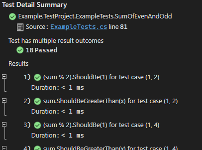

# Getting Started

Create a .NET 6 class library and add some package references:
- [`Microsoft.NET.Test.Sdk`](https://www.nuget.org/packages/Microsoft.NET.Test.Sdk/) - to identify this as a test project
- [`FlUnit`](https://www.nuget.org/packages/FlUnit/) - which contains the important stuff - the builder and test classes
- [`FlUnit.VS.TestAdapter`](https://www.nuget.org/packages/FlUnit.VS.TestAdapter/) - the VSTest adapter package, so that the VSTest platform knows how to find and run FlUnit tests.
- You'll also need to include an assertion library of your choice - the example code below uses [`FluentAssertions`](https://www.nuget.org/packages/FluentAssertions/), for example.
- [`coverlet.collector`](https://www.nuget.org/packages/coverlet.collector/) does work with FlUnit tests - so feel free to add that, too.

NB: a .NET Standard 2.0 version of the framework does exist, and targeting earlier versions of the framework does work, but there are some caveats. Details can be found [here](docs/user-guide/other-notes.md#caveats-when-targeting-net-5-or-earlier). All the examples and documentation below assumes .NET 6.

As shown below, tests are defined as public static gettable properties of public static classes, with the help of a fluent builder to construct them. More examples can be found in the [example test project](./src/Example.TestProject/ExampleTests.cs).

```csharp
using FlUnit;
using FluentAssertions;

public static class MyTests
{
  // First, a heavily annotated example. Start by calling a method on the "TestThat" static class,
  // each of which return a builder to continue with.
  public static Test ProcessingOfCollaborator => TestThat
    // Arrange: Use the "Given" and "And" methods to provide delegates for obtaining each
    // prerequisite of the test. Specifying prerequisites is optional. Starting your test
    // with "When" is equally valid.
    .Given(() => new TestSubject())
    .And(() => new Collaborator())
    // Act: Once all prerequisites are specified, call "When" to specify the "Act" part of the test.
    // Provide a delegate that accepts one parameter for each prerequisite. The delegate can return
    // a value or be void.
    .When((sut, collaborator) => sut.Process(collaborator))
    // Assert: assertions can be provided with the "ThenReturns" and "And" methods, or the "ThenThrows"
    // and "And" methods. You provide a delegate for the assertion itself and (optionally) a string
    // description for the associated test result. If you do not provide an explicit description, the text
    // of the assertion argument will be used - trimmed down to just its body if it is a lambda. For
    // "ThenReturns", the delegate should accept one parameter for each prerequisite, and one for the
    // return value of the When clause (if it returns one). For "ThenThrows", see the third example,
    // below. Assertion failure should be indicated by a thrown exception.
    .ThenReturns((sut, collaborator, retVal) => retVal.Should().BeTrue())
    .And((sut, collaborator, retVal) => sut.HasProcessed.Should().BeTrue())
    .And((sut, collaborator, retVal) => collaborator.HasBeenProcessed.Should().BeTrue());
    // NB: No call required to build a Test from a builder - builders with at least one declared assertion
    // are implicitly convertible to Test instances.

  // You may find that a single 'given' clause returning an anonymous
  // object makes for more readable tests (separate given clauses is more useful when
  // when you have multiple test cases - see below). Also note how C# 9's lambda discard
  // parameters can make assertion clauses clearer. Finally, note that there is a parameterless
  // version of ThenReturns, that adds an assertion that just verifies that the
  // when clause returned successfully:
  public static Test ProcessingOfCollaborator_ButPrettier => TestThat
    .Given(() => new
    {
        sut = new TestSubject(),
        collaborator = new Collaborator()
    })
    .When(given => given.sut.Process(given.collaborator))
    .ThenReturns()
    .And((_, retVal) => retVal.Should().BeTrue())
    .And((given, _) => given.sut.HasProcessed.Should().BeTrue())
    .And((given, _) => given.collaborator.HasBeenProcessed.Should().BeTrue());

  // Expecting exceptions is easy, and test traits are supported
  // (at the test, class or assembly level):
  [Trait("Category", "Negative Tests")]
  public static Test ProcessThrowsOnNullCollaborator => TestThat
    .Given(() => new TestSubject())
    .When(sut => sut.Process(null))
    // Obviously, the difference between this and 'ThenReturns' is that the
    // final parameter of the delegate is the thrown exception, not the return value.
    // A paramaterless overload of ThenThrows also exists, which adds an assertion
    // that just verifies that an exception was thrown:
    .ThenThrows((_, exception) => exception.Should().BeOfType(typeof(ArgumentNullException)));

  // Parameterised tests are supported without awkward attribute-based
  // argument retrieval. This is my favourite aspect of FlUnit - and I suspect
  // that anyone who tends toward parameterised tests will enjoy this.
  public static Test SumOfEvenAndOdd => TestThat
    .GivenEachOf(() => new[] { 1, 3, 5 })
    .AndEachOf(() => new[] { 2, 4, 6 })
    .When((x, y) => x + y)
    .ThenReturns()
    .And((_, _, sum) => (sum % 2).Should().Be(1))
    .And((x, _, sum) => sum.Should().BeGreaterThan(x));
}
```

## Test Execution & Results

If you've included a reference to the VSTest adapter, the Visual Studio IDE and `dotnet test` should both be able to find and run the tests.

With the VSTest adapter:
* Tests are named for the name of the property.
* Tests with multiple cases or multiple assertions give one result per test case per assertion. It is possible to override this logic with a configuration setting, but by default the label of each result depends on the multiplicity of cases and assertions, as follows:
  * With a single case and multiple assertions, the result label is the description of the assertion.
  * With multiple cases each with a single assertion, the result label is the ToString of the case (which when there are multiple given clauses, is a value tuple of each)
  * With multiple cases each with a multiple assertions, the result label is "\{assertion description\} for test case \{case ToString\}", like this:  
    
* The duration reported for each result is the time taken for the `When` clause (and only the `When` clause) to execute. Configurability of this behaviour is on the list for v1.1.
